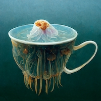

# After The Hype

Is there some protein to the proposition of non-fungible tokens?
Now that the hype is over, I want to answer some questions for myself:

1. are there good reasons to buy an NFT in 2023?
1. is copyright enforced?
1. is there any innovation of substance to NFTs?

{:toc}

## I Bought a JPEG of a Jellyfish

This is it:



It cost me about $75 worth of Ethereum.
The [high resolution image](https://ipfsgateway.makersplace.com/ipfs/QmQym1BD9Rohcv6EYQECdJVxxWAFQG1cWZkCHsFhxrPPL7) I could always access!
Just like you, you can download it and print it if you like.
So what did the $75 buy me?

## It's Mine, Not Yours

From the [Makersplace frequently-asked-questions section](https://makersplace.com/faq/):
```
You're buying a limited edition digital creation, signed by the creator. Upon purchase, you'll be given the right to use, distribute and display the creation for non-commercial purposes. Since you own this unique creation, you can also re-sell the same non-commercial use rights, to the creation, on a secondary market or even directly on MakersPlace.

Upon purchase, you can access the high resolution digital file which you can display on any digital device or even print out, for personal use. All the while, knowing that you have the authentic piece, verifiable on the blockchain.
```

I am not a lawyer. I like [Poe's web search for legal questions](https://poe.com/s/Id15GjrqTMqT2UpoSJc5):

> Under Dutch law, if someone uses, distributes, or displays a creation obtained from MakersPlace in violation of the non-commercial purposes restriction, you can take legal action to enforce your commercial rights. Here are the steps you can take:
> 1. Gather evidence: Collect evidence that clearly demonstrates the infringement, such as screenshots, copies of communications, or any other relevant documentation.
> 2. Cease and desist letter: Send a cease and desist letter to the infringing party, demanding that they immediately stop using, distributing, or displaying the creation for commercial purposes. Include details of the infringement, the non-commercial restriction, and a deadline for compliance.
> 3. Mediation or negotiation: If the infringing party is willing, you can attempt to resolve the issue through mediation or negotiation. This may involve discussions on licensing the commercial rights or reaching a settlement agreement.
> 4. Preliminary injunction: If the infringing party refuses to comply with your demands, you can seek a preliminary injunction from the court. This is an urgent legal measure that can prohibit the infringing party from continuing the infringing activities until a final decision is reached.
> 5. Lawsuit: If the preliminary injunction is granted or if mediation/negotiation fails, you can file a lawsuit against the infringing party. In the lawsuit, you can seek damages for the infringement, including any financial losses you have suffered as a result of the unauthorized commercial use of your creation.
> 6. Court decision: The court will evaluate the evidence and arguments presented by both parties and make a decision. If the court finds in your favor, it may order the infringing party to cease the infringing activities, pay damages, and cover your legal costs.
> ---
> Learn more:
> 1. [Netherlands - Protecting Intellectual Property](https://www.trade.gov/country-commercial-guides/netherlands-protecting-intellectual-property)
> 2. [Enforcement of Intellectual Property rights in The Netherlands](https://www.amsadvocaten.com/practice-areas/intellectual-property/enforcement-of-intellectual-property/)
> 3. [IP rights enforcement in Netherlands - Lexology](https://www.lexology.com/library/detail.aspx?g=bc9847e5-ac3e-4a98-a935-9cf6befc20a8)

I see many challenges here!

A far from exhaustive list:

1. Territoriality
1. Evidence
1. Cost

### Territoriality

I could convince a judge in the Netherlands that someone infringed on my copyrights.
Actually enforcing that judgement is hard, because of the territoriality principle:

> Territoriality Principle: Intellectual property rights, including copyright, patents, and trademarks, are generally territorial in nature. This  > means that they are granted and enforced within the boundaries of a specific country or jurisdiction.

Let's say someone from Argentina downloads the JPEG above and prints it for personal use.
I somehow find out and convince a judge on my side of the pond that they are in the wrong.
Now what? Is there a treaty regarding intellectual property between Argentina and the Netherlands?
Even if there is, can the Argentinian law enforcement apparatus be bothered to identify this person and correct their behavior?
I think they have more important things to do.

### Cost

I asked Poe how much it would cost me but it [can't really tell](https://poe.com/s/9XCYQ5xRvJt6x34SDkZg).

>Indicative Standards for IP Cases:
>- Fairly simple injunction procedures: Maximum of €6,000

That exceeds the nominal value of the thing by two orders of magnitude.
I probably would not bother.

### Gathering Evidence

If someone would use the jellyfish image on the internet, I could probably find out with [reverse image search](https://tineye.com/search/2083364697ef99537010360ef63e91c7cc103876?sort=score&order=desc&page=1).
This reverse image search provider does not return a single result, where I would expect at least one: the thumbnail image on Makersplace.
Knowing where an illicit copy of the image is hosted does not equate knowing who ~~owns~~ controls that hosted copy.

## It's a Nice Jellyfish, For Everyone Involved

I printed the image for about €25 on acrylic glass.
It looks very nice on my kitchen wall.
The material really brings out the under water feeling.

I'm happy because I got a unique art piece for roughly €100 in total.
That's pretty far below the market.
I would estimate unique pieces of this size start around €300-ish.

For the maker it's also a good deal.
He produced a series of 100 jellyfish with generative AI and made 50$ each.
Makersplace takes 15%, so they made $750 off of this drop.
That leaves $4250 for what I imagine was a couple of days' work. Not bad, [jrdsctt](https://makersplace.com/jrdsctt).

Trying to state this transaction in more general terms:
- the maker had only 15% distribution cost to sell his artwork across the globe to up to 100 buyers
- in terms of effort, the work ended with creating the images and minting the NFT. No trips to the printing press, nothing they had to leave the office for.
- I'm happy because I get a unique art piece, even though I can't enforce this uniqueness in practice
- Makersplace is happy because they have limited marginal costs per sale. According to their FAQ they spend between $3 and $15 in gas costs, ie. transaction costs to place the image reference on the Ethereum blockchain.

## Well, Maybe Not Everyone

I made a bid on three other jellyfish.
One bid was above the initial asking price and two bids were below the initial asking price.
You're allowed to go below the initial asking price, but Makersplace does not display those lowball offers in their latest bids carousel.
Clearly that's not something they want to emphasize; the only way ought to be up.
I never got back from any of the three owners.
I can't tell if they did not like the bid or that they forgot they owned a digital jellyfish.

The NFT market has [tanked](https://www.investmentmonitor.ai/crypto/nft-market-collapse-cryptocurrency-value/?cf-view), in terms of volume and price.
Most of it was of poor quality!
There is a literal sea of poorly created images, especially on [opensea](https://opensea.io/).

It does not surprise me that nobody wants those.

The question that remains: without any practical means of enforcing copyright and stripped of its get-rich-quick dynamics, is there still a place for NFTs?

I'm tentatively positive that there is such a place for high quality art that you'd want to print and put up on your wall to look at.


