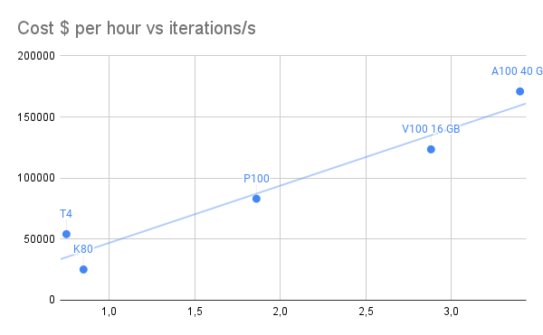

# Best VM for Dataframe operations

There many options for running ETL code with GPU acceleration, for example:
- [Spark-Rapids](https://nvidia.github.io/spark-rapids/)
- [Dask](https://docs.dask.org/en/stable/)
- [cudf.Pandas](https://rapids.ai/cudf-pandas/)

If you're considering adopting one of these frameworks, one of the first questions you'll encounter is: which VM is the most cost-effective for my workload?

## Performance versus Cost

Among the CompuBench tests, the "N-Body simulation" benchmarks are likely the most relevant for predicting cuDF performance. These tests involve complex calculations and data manipulations similar to operations performed in cuDF, which is designed for data frame manipulation and analysis. 

| GPU        | SKU                 | Instance        | Azure $ per hour pay-as-you-go UK South | N-Body simulation – 1024k - iterations/s | iterations/h | $/billion iterations | 
|------------|---------------------|-----------------|-----------------------------------------|-----------------------------------------|--------------|----------------------|
| T4         | NCas_T4_v3-series   | NC4as T4 v3     |                                   0,615 |                                   54082 |    194695200 |          3,158783576 | 
| V100 16 GB | NCv3-series         | NC6s v3         |                                   3,589 |                                  123497 |    444589200 |          8,072620747 |    
| A100 40 GB | NC A100 v4 series   | NC24ads A100 v4 |                                   4,590 |                                  170915 |    615294000 |          7,459848463 |    
| A10        | NVads A10 v5 series | NV36ads A10 v5  |                                       4 |                                   97834 |    352202400 |          11,35710603 |

The T4 is most likely the most cost-effective for our application, with the A100 coming in second.

## Closest Alternative to T4

We can look at the closest non-GPU backed alternative to the T4 with 4 vCPUs, 28 GiB memory and 180 SSD GB storage, eg. [Standard_D12_v2](https://learn.microsoft.com/nl-nl/azure/virtual-machines/dv2-dsv2-series-memory) with 4 vCPUs, 28 GiB memory and 200 SSD GB storage at $0.4690/hour. 

Yifeng Jiang achieved a [4x performance increase](https://uprush.medium.com/accelerating-apache-spark-with-rapids-on-gpu-27b2b8a77344) with GPU-accelerated Spark-Rapids on an A10. 
Of course, the A10 is a more performant machine.

Let's assume we can generalize the performance of the T4 versus the performance of the A10 on the Nbody benchmark to dataframe processing.

|                                               |             |
|-----------------------------------------------|-------------|
| A10 performance multiple on dataframes        |           4 |
| A10 performance on N-body simulation          |       97834 |
| T4 performance on N-body simulation           |       54082 |
| T4 performance multiple on dataframes         | 2,211174029 |
| Cost Ratio NC4as T4 v3 versus Standard_D12_v2 |  1,31130064 |
| Cost effectiveness of NC4as T4 v3             |  1,68624491 |
| Cost reduction per compute unit               |       40,70 |

> Assuming the NC4as T4 v3 performance can be generalized from the Nbody benchmark, it would perform 121% faster on dataframe processing, at 41% reduced cost per iteration.

## Scaling Unit

For all but the largest workloads, we want to make sure our cloud infrastructure matches our compute workload as it varies throughout the day. Having a smaller scaling unit reduces our chances of being overprovisioned often.

## Future Proof

The T4 has been around since 2018, but there are no plans to discontinue [the NCas_T4_v3 offering](https://learn.microsoft.com/en-us/azure/virtual-machines/nct4-v3-series).

| GPU        | Release by Nvidia  |
|------------|--------------------|
| V100 16 GB | June 21, 2017      |
| T4         | September 12, 2018 |
| A100 40 GB | May 14, 2020       |
| A10        | April 12, 2021     |

## Power Efficiency

The T4 is designed for efficiency and has a lower power draw compared to the A100. This could be a consideration if power consumption and heat generation are concerns in your deployment environment.

## Sources

1. Benchmarks from [Compubench](https://compubench.com)
1. Nvidia [release dates](https://en.wikipedia.org/wiki/List_of_Nvidia_graphics_processing_units) from wikipedia