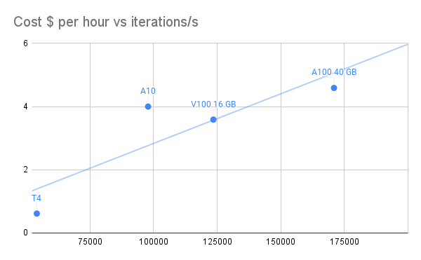

# Best VM for Dataframe operations

There many options for running ETL code with GPU acceleration, for example:
- [Spark-Rapids](https://nvidia.github.io/spark-rapids/)
- [Dask](https://docs.dask.org/en/stable/)
- [cudf.Pandas](https://rapids.ai/cudf-pandas/)

If you're considering adopting one of these frameworks, one of the first questions you'll encounter is: which VM is the most cost-effective for my workload?

## Performance versus Cost

Among the CompuBench tests, the "N-Body simulation" benchmarks are likely the most relevant for predicting cuDF performance. These tests involve complex calculations and data manipulations similar to operations performed in cuDF, which is designed for data frame manipulation and analysis. 

| GPU        | SKU                 | Instance        | Azure $ per hour pay-as-you-go UK South | N-Body simulation – 128k - iterations/s | iterations/h | $/billion iterations | $/billion iterations |
|------------|---------------------|-----------------|-----------------------------------------|-----------------------------------------|--------------|----------------------|----------------------|
| T4         | NCas_T4_v3-series   | NC4as T4 v3     |                                   0,615 |                                   54082 |    194695200 |          3,158783576 |          3,158783576 |
| V100 16 GB | NCv3-series         | NC6s v3         |                                   3,589 |                                  123497 |    444589200 |          8,072620747 |          8,072620747 |
| A100 40 GB | NC A100 v4 series   | NC24ads A100 v4 |                                   4,590 |                                  170915 |    615294000 |          7,459848463 |          7,459848463 |
| A10        | NVads A10 v5 series | NV36ads A10 v5  |                                       4 |                                   97834 |    352202400 |          11,35710603 |          11,35710603 |

The T4 and A100 VMs are likely the most cost-effective for our application. 
Yifeng Jiang compared [Spark versus Spark-rapids](https://uprush.medium.com/accelerating-apache-spark-with-rapids-on-gpu-27b2b8a77344) on A10 machines. In terms of pricing, those are not competitive.

What is the score to beat? 
We can look at the closest non-GPU backed VM with 4	vCPUs, 28 GiB memory and 180 SSD GB storage, eg. [Standard_D12_v2](https://learn.microsoft.com/nl-nl/azure/virtual-machines/dv2-dsv2-series-memory) with 4 vCPUs, 28 GiB memory and 200 SSD GB storage at $0.4690/hour. 

## Scaling Unit

For all but the largest workloads, we want to make sure our cloud infrastructure matches our compute workload as it varies throughout the day. Having a smaller scaling unit reduces our chances of being overprovisioned often.

## Sources

1. Benchmarks from [Compubench](https://compubench.com)