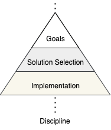
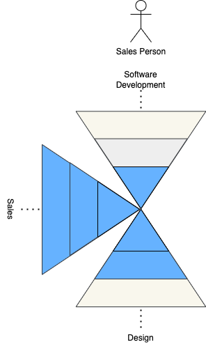
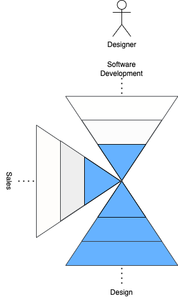
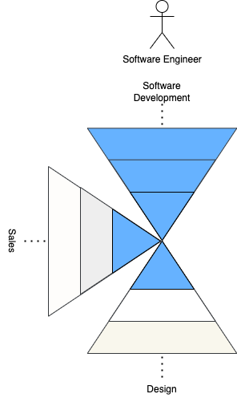
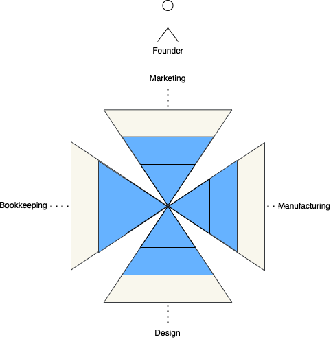

# The One Man Unicorn Business

Sam Altman [predicts](https://x.com/alexisohanian/status/1752753792058294725) there will soon be a billion dollar enterprise run by a single person.

This is a framework for the mechanism of the concentration in skills that is required to build and operate a complex business.

## Competence

A simplified model of competence in a certain discipline consists of three levels:

1. selecting business goals that can be achieved with a certain discipline
1. selecting approaches to achieve that business goal
1. proposing and implementing approaches

In simpler terms:
1. how to make money doing something
1. who to hire or which tools to buy
1. how to do the job itself

The three levels of competence are drawn as a pyramid to reflect that it takes much more time to reach the following level for an individual.

Examples:
1. an operator in the purchasing department has reached level 2 in a number of disciplines to make effective buying decisions
1. a designer can select business goals, tactics to achieve that business goal and implement them, but is largely constrained to that discipline
1. an entrepreneur is well-versed in some of the disciplines required to run their business, but relies on team members to come up with solutions, or even select proposals for disciplines they have the least experience with

## Teams

A typical founding team consists of a number of people with a varying level of competence in a number of disciplines.

The three members of the founding team have the complementary skills to implement all aspects of the business, but also to hire talent within their disciplines and grow the enterprise.

Problems may arise when additional disciplines are needed to keep the business afloat. How would this team judge whether someone is a good candidate for a bookkeeping role? Or whether a supplier's solution meets the needs of your business? This requires the team to develop a deeper understanding of another discipline to reach level 2 competence.

Founding teams of complex businesses are multiheaded today because rarely are solo founders skilled enough to effectively buy implementation in all the required disciplines. Founding teams members are around to a) consult on what to do to move the business forward and b) implement their plans within their discipline.

## Going Solo

The future single founder is competent enough in each of the disciplines required for their business to make effective buying decisions, or implement the solution themselves, for business of growing complexity.
LLMs have the power to bring anyone from the first level of competence to the second.

Solo founders have been around for a while, but the scale and complexity that the business can reach will start to reach unprecedented levels.

